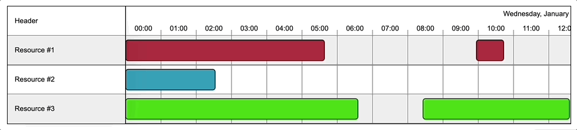
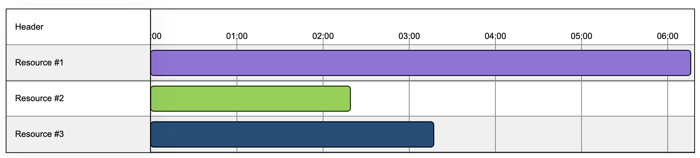
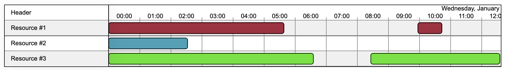
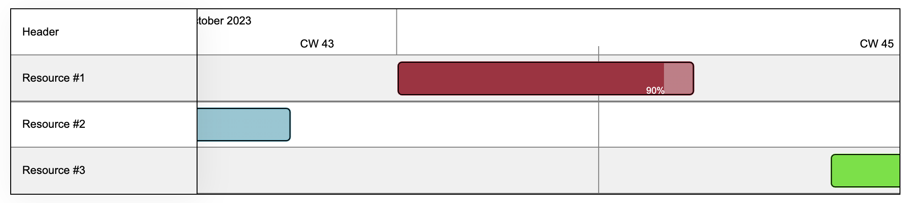
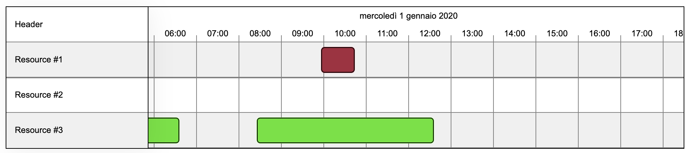
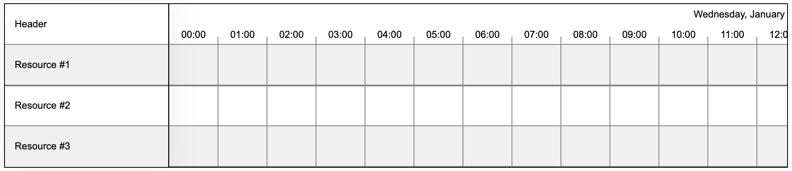
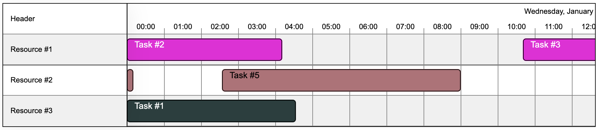

# @melfore/konva-timeline

[](https://github.com/melfore/konva-timeline/actions/workflows/release.yml) [](http://commitizen.github.io/cz-cli/)

`@melfore/konva-timeline` is a TypeScript ReactJS library that uses `konva` and `react-konva` to render a timeline component using canvas.

<a href="https://github.com/melfore/konva-timeline/blob/master/CHANGELOG.md" target="_blank">**Changelog**</a> | <!--a href="https://github.com/melfore/mosaic/blob/master/CONTRIBUTING.md" target="_blank">**Contributing**</a> | <a href="https://github.com/melfore/mosaic/blob/master/MIGRATION.md" target="_blank">**Migration**</a> | --> <a href="https://melfore.github.io/mosaic/latest/" target="_blank">**Storybook**</a>



## Features

This library is meant to represent data on a time range. It has been developed in a way to be the most generic it could. It can be used to display _gantt charts_, _schedulers_ and _planners_.

The library follows the concept of organizing data (tasks) belonging to specific groups (resources) over a predefined time window.

### Interaction

There can be from none to many tasks per each resource and tasks can be moved across resources. Tasks can also be resized and hovered.

For each user interaction with tasks there is a dedicated hook function exposed by the component's props. This enables various use cases like displaying the details of a task inside a modal or calling an API each time the task is moved.

### Custom display

Size of columns and rows can be adjusted using dedicated props:





### Tasks

In many of the above mentioned use cases it's important to track the progress of tasks. That's why we offer a built-in visualization for percentage of completion:



### Localization

Date formats and static texts can be localized:



## Getting started

To install the library run:

```
npm i @melfore/konva-timeline
```

This library has the following required peerDependencies:

```
"konva": ">= 9.2.0 < 10",
"luxon": ">= 3.3.0 < 4",
"react": ">= 18.2.0 < 19",
"react-dom": ">= 18.2.0 < 19",
"react-konva": ">= 18.2.9 < 19",
"react-konva-utils": ">= 1.0.5 < 2"
```

### ⚠️ Installing with npm < 7

If installing with versions of npm < 7, you have to manually install them.

```
npm i konva luxon react react-dom react-konva
```

Beware to check the versions installed, they must match peerDependencies ranges.

### Usage

Import the `KonvaTimeline` component from `@melfore/konva-timeline` library:

```
import { KonvaTimeline } from "@melfore/konva-timeline";
```

Provide the minimum set of required props.

```
  <KonvaTimeline
    range={{
      end: 1577919600000,
      start: 1577833200000
    }}
    resources={[
      {
        color: '#74ff93',
        id: '1',
        label: 'Resource #1'
      },
      {
        color: '#7de7dd',
        id: '2',
        label: 'Resource #2'
      },
      {
        color: '#a6bbec',
        id: '3',
        label: 'Resource #3'
      }
    ]}
  />
```

This will print an empty timeline with three resources:



Add an array of tasks:

```
  <KonvaTimeline
    range={{
      end: 1577919600000,
      start: 1577833200000
    }}
    resources={[
      {
        color: '#74ff93',
        id: '1',
        label: 'Resource #1'
      },
      {
        color: '#7de7dd',
        id: '2',
        label: 'Resource #2'
      },
      {
        color: '#a6bbec',
        id: '3',
        label: 'Resource #3'
      }
    ]}
+   tasks={[
+     {
+       id: '4',
+       label: 'Task #4',
+       resourceId: '2',
+       time: {
+         end: 1577873580100,
+         start: 1577853960100
+       }
+     },
+     {
+       id: '2',
+       label: 'Task #2',
+       resourceId: '1',
+       time: {
+         end: 1577835900000,
+         start: 1577833200000
+       }
+     },
+     {
+       id: '1',
+       label: 'Task #1',
+       resourceId: '2',
+       time: {
+         end: 1577853300000,
+         start: 1577833200000
+       }
+     },
+     {
+       id: '3',
+       label: 'Task #3',
+       resourceId: '1',
+       time: {
+         end: 1577854980100,
+         start: 1577837160100
+       }
+     },
+     {
+       id: '5',
+       label: 'Task #5',
+       resourceId: '3',
+       time: {
+         end: 1577843820000,
+         start: 1577833200000
+       }
+     }
+   ]}
  />
```

The `resourceId` property of each task assigns the task to the respective resource.



## Documentation and examples

Browse <a href="https://melfore.github.io/konva-timeline">official StoryBook</a>
