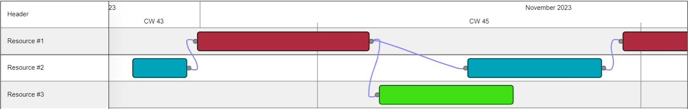
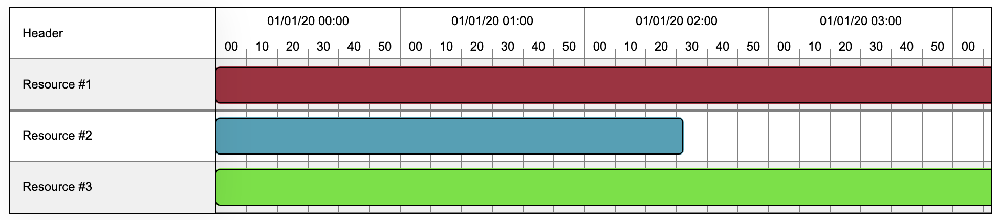
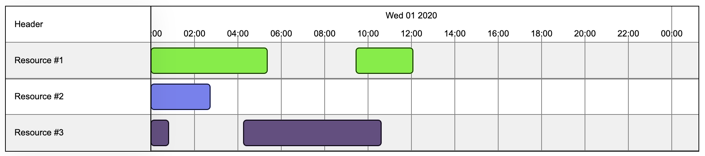
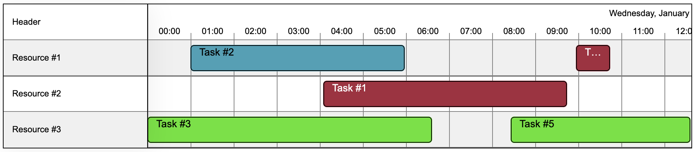
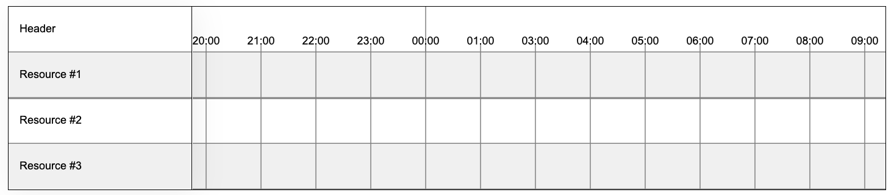
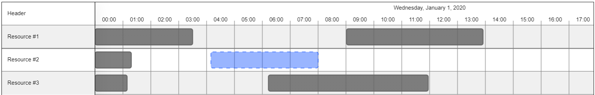
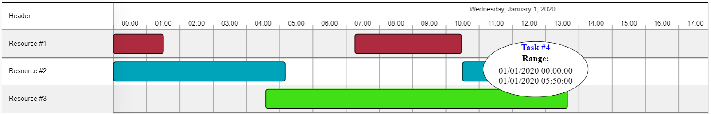

# @melfore/konva-timeline

[](https://github.com/melfore/konva-timeline/actions/workflows/release.yml) [](http://commitizen.github.io/cz-cli/)

`@melfore/konva-timeline` is a TypeScript ReactJS library that uses `konva` and `react-konva` to render a timeline component using canvas.

<a href="https://github.com/melfore/konva-timeline/blob/master/CHANGELOG.md" target="_blank">**Changelog**</a> | <!--a href="https://github.com/melfore/mosaic/blob/master/CONTRIBUTING.md" target="_blank">**Contributing**</a> | <a href="https://github.com/melfore/mosaic/blob/master/MIGRATION.md" target="_blank">**Migration**</a> | --> <a href="https://melfore.github.io/konva-timeline" target="_blank">**Storybook**</a>


## Features

This library is meant to represent data on a time range. It has been developed in a way to be the most generic it could. It can be used to display _gantt charts_, _schedulers_ and _planners_.

The library follows the concept of organizing data (tasks) belonging to specific groups (resources) over a predefined time window.

### Interaction

There can be from none to many tasks per each resource and tasks can be moved across resources. Tasks can also be resized and hovered.

For each user interaction with tasks there is a dedicated hook function exposed by the component's props. This enables various use cases like displaying the details of a task inside a modal or calling an API each time the task is moved.

### Gantt

In order to create and display connection between tasks is neccesary setting dedicated props:
- relatedTasks is a string array prop of TaskData that contains Ids of related Tasks.
- enableLines is a global prop for the visualization of the connections.

In this case OnTasksChange return also array of all tasks id that are inpacted by changed end of a the task at hand, and value of time in milliseconds of this variation.

⚠️ By relatedTasks is mean these tasks that their start can depends of the end of the task in question.



### Custom display

Size of columns and rows can be adjusted using dedicated props:


Resolution of the timeline can be changed as well, choosing the right one for your scenario.

Below a comparison of the same data set using 5 mins resolution:



Now with 2 hours resolution:



### Tasks

In many of the above mentioned use cases it's important to track the progress of tasks. That's why we offer a built-in visualization for percentage of completion:


Tasks can also have their label displayed:



### Handling timezones and DST

The library uses `luxon` to handle dates and date-times. This allows localization (see next paragraph) and handling of timezones and DST.

The default timezone configuration is `system` (meaning the system's local zone). This can be overridden using the dedicated prop.

Along with timezones, the library handles DST changes (if any).
In the example below the switch of DST for spring 2020, happening between March 28th and March 29th.



### Localization

Date formats and static texts can be localized:


### Area Select

Select area to get its timeRange and resourceId:



### Personalized ToolTip

It's possible to personalize the toolTip passing createToolTip callback that return jsx element



## Getting started

To install the library run:

```
npm i @melfore/konva-timeline
```

This library has the following required peerDependencies:

```
"konva": ">= 9.2.0 < 10",
"luxon": ">= 3.3.0 < 4",
"react": ">= 18.2.0 < 19",
"react-dom": ">= 18.2.0 < 19",
"react-konva": ">= 18.2.9 < 19",
"react-konva-utils": ">= 1.0.5 < 2"
```

### ⚠️ Installing with npm < 7

If installing with versions of npm < 7, you have to manually install them.

```
npm i konva luxon react react-dom react-konva
```

Beware to check the versions installed, they must match peerDependencies ranges.

### Usage

Import the `KonvaTimeline` component from `@melfore/konva-timeline` library:

```
import { KonvaTimeline } from "@melfore/konva-timeline";
```

Provide the minimum set of required props.

```
  <KonvaTimeline
    range={{
      end: 1577919600000,
      start: 1577833200000
    }}
    resources={[
      {
        color: '#f00bda',
        id: '1',
        label: 'Resource #1'
      },
      {
        color: '#b66f77',
        id: '2',
        label: 'Resource #2'
      },
      {
        color: '#273e3e',
        id: '3',
        label: 'Resource #3'
      }
    ]}
  />
```

This will print an empty timeline with three resources:


Add an array of tasks:

```
  <KonvaTimeline
    range={{
      end: 1577919600000,
      start: 1577833200000
    }}
    resources={[
      {
        color: '#74ff93',
        id: '1',
        label: 'Resource #1'
      },
      {
        color: '#7de7dd',
        id: '2',
        label: 'Resource #2'
      },
      {
        color: '#a6bbec',
        id: '3',
        label: 'Resource #3'
      }
    ]}
+   tasks={[
+     {
+       id: '4',
+       label: 'Task #4',
+       resourceId: '2',
+       time: {
+         end: 1577833740000,
+         start: 1577833200000
+       }
+     },
+     {
+       id: '2',
+       label: 'Task #2',
+       resourceId: '1',
+       time: {
+         end: 1577848200000,
+         start: 1577833200000
+       }
+     },
+     {
+       id: '1',
+       label: 'Task #1',
+       resourceId: '3',
+       time: {
+         end: 1577849520000,
+         start: 1577833200000
+       }
+     },
+     {
+       id: '3',
+       label: 'Task #3',
+       resourceId: '1',
+       time: {
+         end: 1577885040100,
+         start: 1577871660100
+       }
+     },
+     {
+       id: '5',
+       label: 'Task #5',
+       resourceId: '2',
+       time: {
+         end: 1577865540100,
+         start: 1577842440100
+       }
+     }
+   ]}
  />
```

The `resourceId` property of each task assigns the task to the respective resource.


## Documentation and examples

Browse <a href="https://melfore.github.io/konva-timeline">official StoryBook</a>
